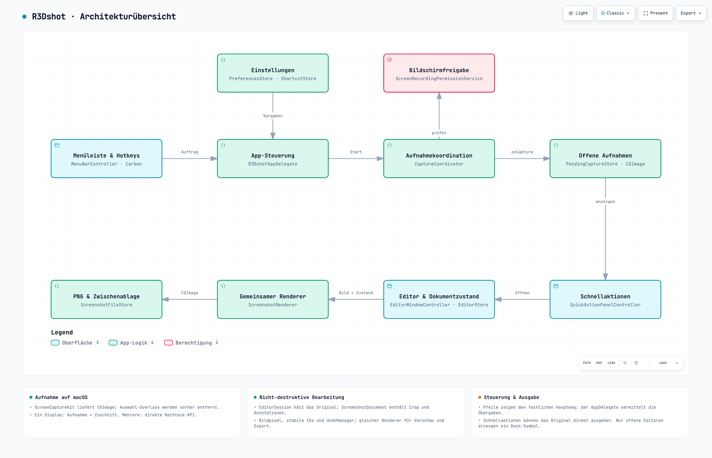
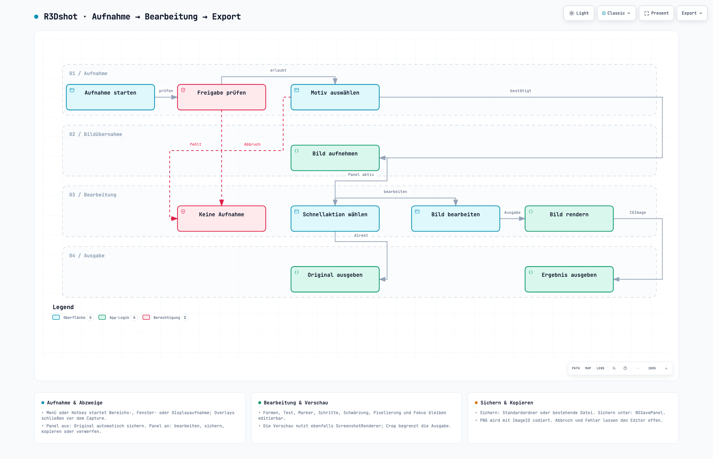

# R3Dshot: Architektur und Aufnahmeablauf

Stand: 6. September 2026. Grundlage: zuerst `PROJECT_SUMMARY.md`, danach der aktuelle Swift-Code im sauberen Checkout bei `6bcebf8` (vor diesen Dokumentationsergänzungen).

- [Architekturübersicht öffnen](architektur.html) — Archify-Typ `architecture`.
- [Aufnahme → Bearbeitung → Export öffnen](ablauf.html) — Archify-Typ `workflow`, Schema v2.

Beide HTML-Dateien sind eigenständig und enthalten das SVG sowie den interaktiven Viewer. Inhalt und Legendenbeschriftungen sind deutsch; feste Viewer-Bedienelemente und das HTML-Sprachattribut fallen mangels deutscher Archify-Lokalisierung auf Englisch zurück. Die JSON-Dateien daneben sind die bearbeitbaren Quellen.

## Vorschauen auf GitHub

Die interaktiven HTML-Dateien herunterladen und lokal im Browser öffnen. Diese PNG-Vorschauen sind direkt auf GitHub sichtbar:

### Architekturübersicht

### Aufnahme → Bearbeitung → Export

## Lesart und Codebelege

Die Architektur zeigt fachliche Übergaben, keine vollständige Klassenabhängigkeitsgrafik. Insbesondere vermittelt der AppDelegate `onCapture`, die Ablage einer offenen Aufnahme und den Editoraufruf. `backend` bezeichnet hier lokale App-Logik, keinen Server. Der Ablauf zeigt den erfolgreichen Editorweg und ausgewählte Abzweige; der automatische Export bei ausgeschaltetem Panel steht in der Begleitkarte.

| Aussage | Codebeleg im Repository |
| --- | --- |
| Menü und globale Carbon-Hotkeys führen über den AppDelegate zu einer Aufnahme | `R3Dshot/App/R3DshotAppDelegate.swift`, `applicationDidFinishLaunching`, `requestCapture`; `R3Dshot/Shortcuts/GlobalHotKeyManager.swift` |
| Bildschirmfreigabe wird erst auf eine angeforderte Aufnahme hin geprüft bzw. angefordert | `R3Dshot/Permissions/ScreenRecordingPermissionService.swift:31`; `R3Dshot/Capture/CaptureCoordinator.swift:147` |
| Ein-Display-Bereich: frisches Displaybild, danach Zuschnitt; displayübergreifender Bereich: `captureImage(in:)` | `R3Dshot/Capture/CaptureCoordinator.swift:256` |
| Fenster: unabhängiger Fensterfilter; Bildschirm: Displayfilter mit Konfiguration | `R3Dshot/Capture/CaptureCoordinator.swift:211`, `:277` |
| Overlays verschwinden vor der Aufnahme; danach folgt eine kurze Compositor-Wartezeit | `R3Dshot/Capture/CaptureCoordinator.swift:353` |
| `CapturedScreenshot` wird als `PendingCapture` im Speicher gehalten; ohne Panel wird sofort das Original gesichert | `R3Dshot/Storage/PendingCapture.swift`; `R3Dshot/App/R3DshotAppDelegate.swift:158` |
| Schnellaktionen: sichern, sichern unter, kopieren, Editor öffnen, verwerfen | `R3Dshot/QuickAction/QuickActionPanelController.swift` |
| `EditorSession` hält das Originalbild; das Dokument hält Metadaten, Crop und Annotationen | `R3Dshot/Editor/EditorStore.swift:72`; `R3Dshot/Editor/Document/ScreenshotDocument.swift:229`, `:308` |
| Undo/Redo registriert Vorher-/Nachher-Dokumentzustände; Auswahl liegt separat im Store | `R3Dshot/Editor/EditorStore.swift:84`, `:1135` |
| Vorschau und Ausgabe verwenden `ScreenshotRenderer.render` | `R3Dshot/Editor/Canvas/EditorCanvasView.swift:19`; `R3Dshot/Editor/EditorPreviewWindowController.swift:159` |
| Renderer zeichnet das Original im Crop und Annotationen nach zIndex; Effekte verarbeiten die bis dahin aufgebaute Komposition | `R3Dshot/Editor/Rendering/ScreenshotRenderer.swift:26`, `:72` und Effektfunktionen |
| Editor-Ausgabe: Standardordner oder bestehende Datei, Save-Panel oder gerenderte PNG-Zwischenablage | `R3Dshot/Editor/EditorPreviewWindowController.swift:167`, `:189`, `:204`; `R3Dshot/Storage/ScreenshotFileStore.swift:96`, `:136` |
| Nur offene Editorfenster erzeugen eine reguläre Dock-App; Schließen schützt ungesicherte Änderungen | `R3Dshot/App/R3DshotAppDelegate.swift:246`; `R3Dshot/Editor/EditorPreviewWindowController.swift`, `windowShouldClose` |

## Ablauf im Detail

1. Menü oder Hotkey wählt Bereich, Fenster oder Bildschirm. Der Coordinator verhindert gleichzeitig laufende Aufnahmeaufträge.
2. Die Berechtigungsprüfung verwendet CoreGraphics und bei Bedarf eine ScreenCaptureKit-Gegenprüfung. Fehlende Freigabe führt zum Hinweis mit Systemeinstellungen; eine neue Aufnahme kann später erneut gestartet werden.
3. Das Motiv wird ausgewählt. Bei nur einem Bildschirm ist keine gesonderte Displayauswahl nötig. Escape bzw. Auswahlabbruch erzeugt kein Bild.
4. Overlays schließen; ScreenCaptureKit liefert ein `CGImage`. Der AppDelegate legt eine offene Aufnahme an. Fehler werden als Hinweis angezeigt.
5. Mit aktivem Schnellaktionspanel kann die Person bearbeiten, direkt sichern, sichern unter, kopieren oder verwerfen. Ohne Panel erfolgt direktes Sichern im Standardordner. Erfolgreiche Schnellaktionen entfernen den Pending-Eintrag; bei Fehlern oder abgebrochenem Save-Panel bleibt er erhalten.
6. Im Editor bleiben Original und Änderungen getrennt. Crop, Formen, Text, Sprechblasen, Schrittmarker, Marker, Schwärzung, Pixelierung und Fokus teilen das Dokumentmodell. Mehrfachauswahl, Anordnung und Undo/Redo ändern dieses Modell; die Vorschau rendert daraus.
7. Beim Export entsteht ein neues, auf den Crop begrenztes Bild. `ScreenshotFileStore` codiert PNG über ImageIO und schreibt die Datei oder setzt PNG-Daten auf `NSPasteboard.general`.
8. Sichern aktualisiert `savedURL` und den gesicherten Dokumentzustand. Kopieren markiert den Editor nicht als gesichert. Abbruch bzw. Exportfehler schließen den Editor nicht.

## Abgrenzung zum älteren Architekturkonzept

`docs/ARCHITECTURE.md` enthält auch frühere Entwurfsannahmen. Für diese Diagramme zählt der Code: keine temporäre Original-PNG, kein separater Capture-Actor, keine belegte reduzierte Renderer-Ausgabe für die Vorschau und kein Projektdatei-Speicherpfad trotz codierbarem Dokumentmodell. Der CaptureCoordinator ist `@MainActor`; der Editor-Export wird im aktuellen Fenstercontroller synchron aufgerufen. Die Notiz zur direkten Rechteck-API gilt nur für displayübergreifende Bereichsaufnahmen.

## Prüfung und Nachweise

Die `*.receipt.json`-Dateien enthalten SHA-256 und Bytezahlen für die jeweilige JSON-Spezifikation und die ausgelieferte HTML-Datei sowie die neun bestandenen Showcase-Prüfungen. Die `*.validation.json`-Dateien enthalten die detaillierten Artefaktprüfungen.

Die `*.visual-check.json`-Dateien dokumentieren die automatische Browserprüfung. Gemessen wurden 1440×900, 1600×1000, 1920×1080 und 2048×1320, jeweils ohne horizontalen oder vertikalen Überlauf. Screenshots der beiden Endgrößen in Hell und Dunkel sowie die HTML-Kontaktbögen liegen daneben. Die ergänzende bildgestützte Sichtprüfung steht in `sichtpruefung.json`; sie ist von der automatischen Prüfung getrennt.

Die abschließende Browserprüfung verwendet den vorhandenen Chromium Headless Shell. Der zuvor versuchte vollständige Chrome-Testbrowser scheiterte zunächst am Start und anschließend an einem DevTools-Timeout; er wurde beendet. Schlüsselbundzugriff ist für die Diagramme nicht erforderlich.

Dies ist eine Dokumentations- und Codeprüfung. R3Dshot wurde dabei nicht neu gebaut oder zur Aufnahme gestartet. Die noch offenen manuellen App-Abnahmen aus `PROJECT_SUMMARY.md` bleiben offen.
